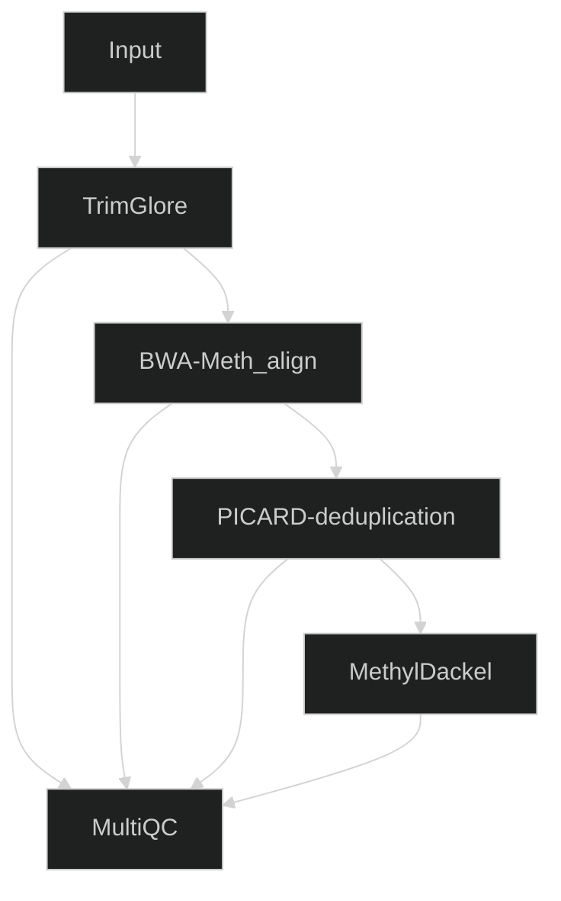

# nf_testdata

```mermaid
 %%{init: {  'logLevel': 'debug', 'theme': 'dark'}  }%%
graph TD;
%%{config: { 'fontFamily': 'Menlo', 'fontSize': 30, 'fontWeight': 400, 'width' : 1600} }%%

Input-->TrimGlore;
TrimGlore-->BWA-Meth_align;
TrimGlore-->MultiQC;
BWA-Meth_align-->MultiQC;
BWA-Meth_align-->PICARD-deduplication;
PICARD-deduplication-->MultiQC;
PICARD-deduplication-->MethylDackel;
MethylDackel-->MultiQC;
```
