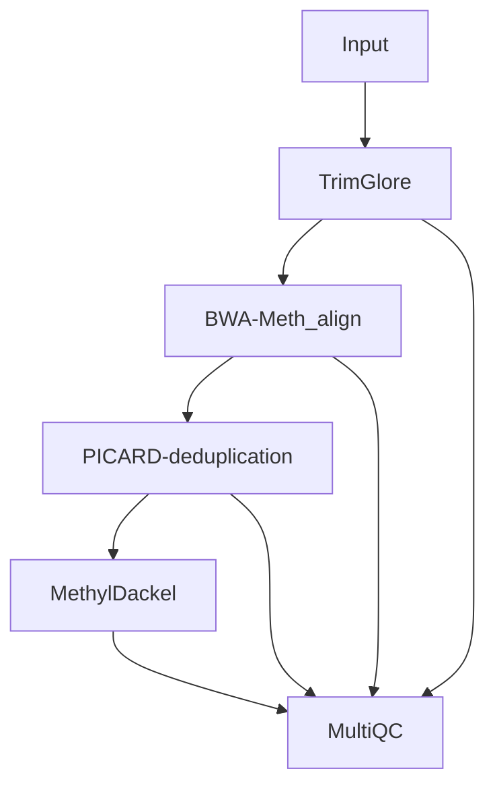
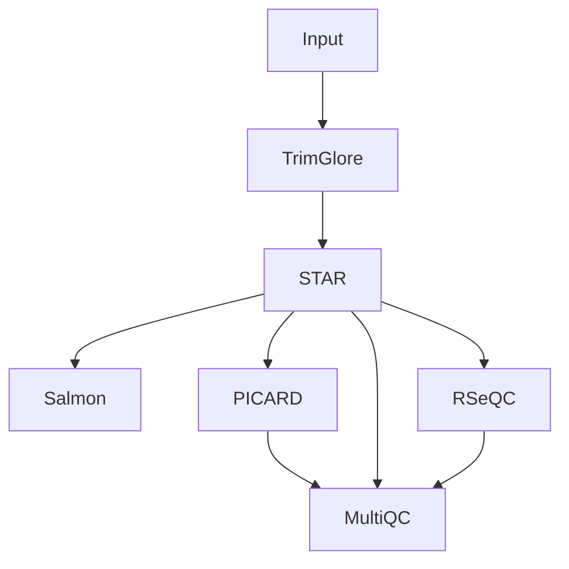

# nf_testdata

```mermaid
graph TD;
  Input-->TrimGlore;
  TrimGlore--> BWA-Meth_align;
  BWA-Meth_align-->PICARD-deduplication;
  PICARD-deduplication-->MethylDackel;
  TrimGlore-->MultiQC;
  PICARD-deduplication-->MultiQC;
  BWA-Meth_align-->MultiQC;
  MethylDackel-->MultiQC;
```

```mermaid
graph TD;
  Input-->TrimGlore;
  TrimGlore--> STAR;
  STAR-->Salmon;
  STAR-->PICARD;
  PICARD-->MultiQC;
  STAR-->MultiQC;
  STAR-->RSeQC;
  RSeQC-->MultiQC;
```
