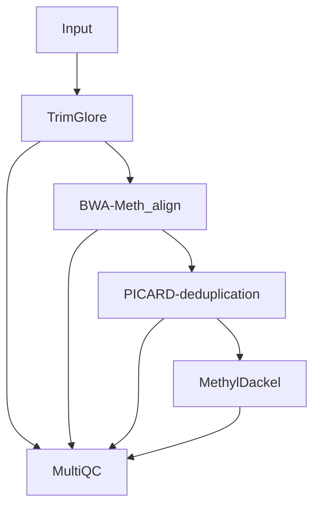

# nf_testdata

```mermaid
 %%{init: { 'startOnLoad':true }%%
graph TD;
%%{config:{ 'flowchart' :{ 'diagramPadding': 20 } }%%
Input-->TrimGlore;
TrimGlore-->BWA-Meth_align;
TrimGlore-->MultiQC;
BWA-Meth_align-->MultiQC;
BWA-Meth_align-->PICARD-deduplication;
PICARD-deduplication-->MultiQC;
PICARD-deduplication-->MethylDackel;
MethylDackel-->MultiQC;
```
