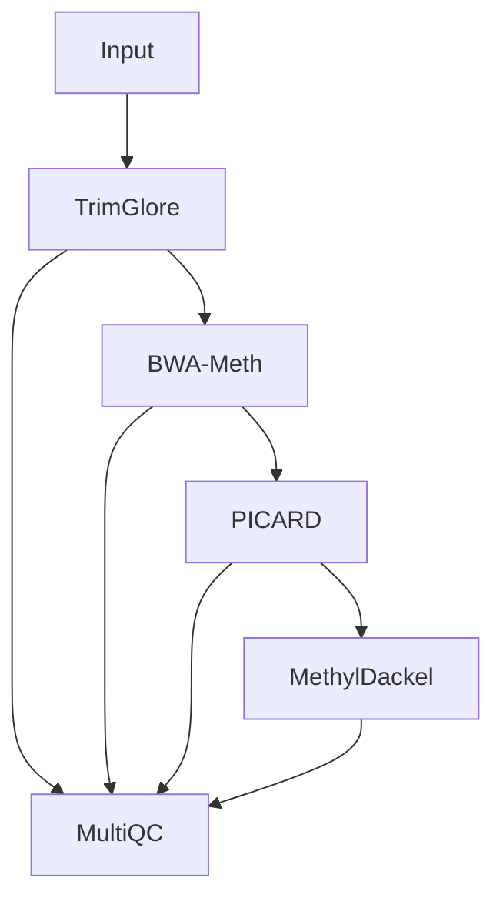

# nf_testdata

```mermaid
 %%{init: { width: 1000}  }%%
graph TD;
Input-->TrimGlore;
TrimGlore-->BWA-Meth;
TrimGlore-->MultiQC;
BWA-Meth-->MultiQC;
BWA-Meth-->PICARD;
PICARD-->MultiQC;
PICARD-->MethylDackel;
MethylDackel-->MultiQC;
```
