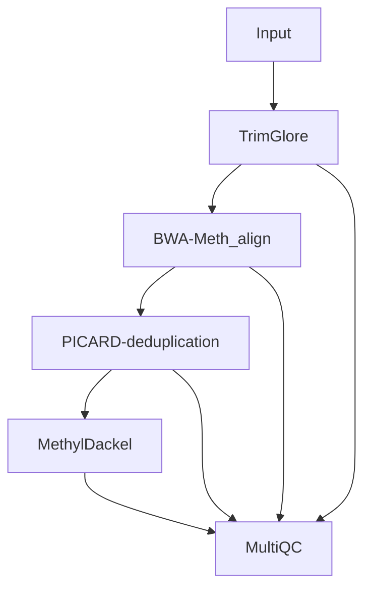
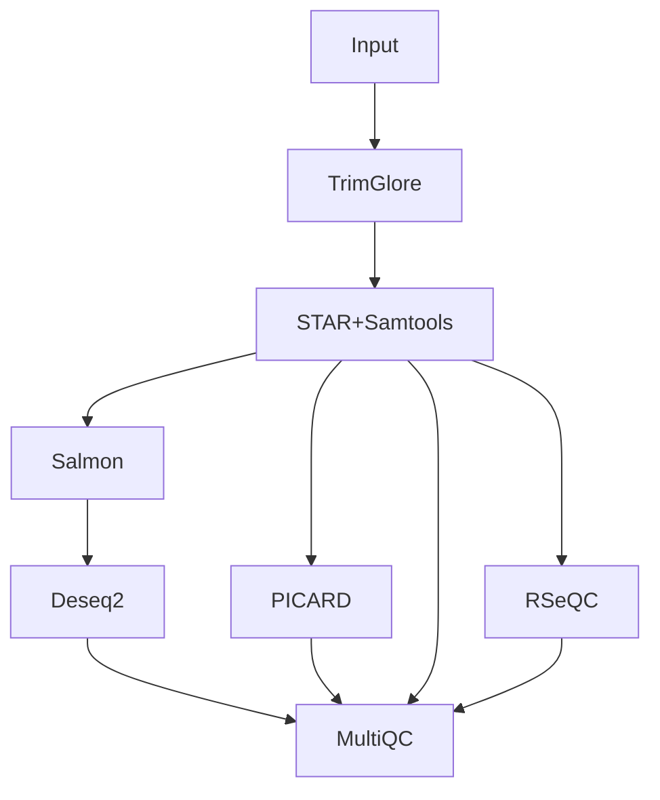
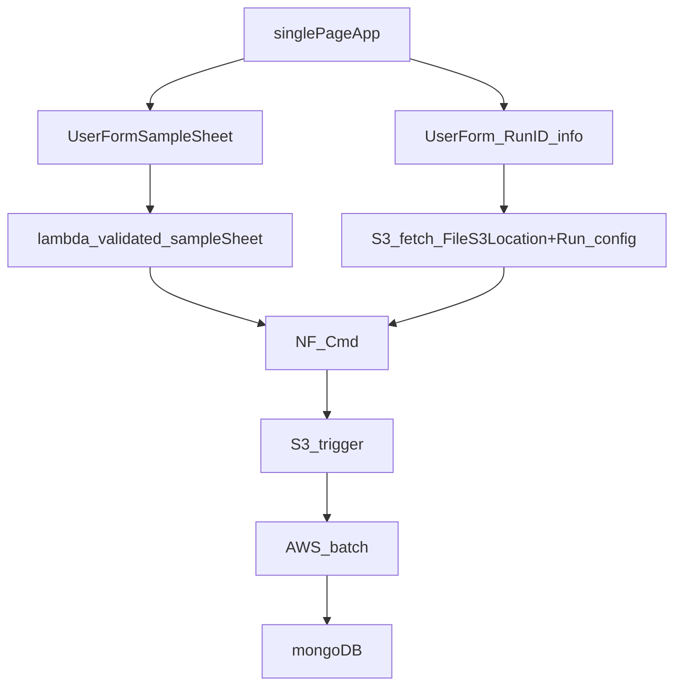

# nf_testdata

```mermaid
graph TD;
  Input-->TrimGlore;
  TrimGlore--> BWA-Meth_align;
  BWA-Meth_align-->PICARD-deduplication;
  PICARD-deduplication-->MethylDackel;
  TrimGlore-->MultiQC;
  PICARD-deduplication-->MultiQC;
  BWA-Meth_align-->MultiQC;
  MethylDackel-->MultiQC;
```

```mermaid
graph TD;
  Input-->TrimGlore;
  TrimGlore--> STAR+Samtools;
  STAR+Samtools-->Salmon;
  Salmon-->Deseq2;
  Deseq2-->MultiQC;
  STAR+Samtools-->PICARD;
  PICARD-->MultiQC;
  STAR+Samtools-->MultiQC;
  STAR+Samtools-->RSeQC;
  RSeQC-->MultiQC;
```

```mermaid
graph TD;
  singlePageApp-->UserForm_RunID_info;
  UserForm_RunID_info-->S3_fetch_FileS3Location+Run_config;
  singlePageApp-->UserFormSampleSheet;
  UserFormSampleSheet-->lambda_validated_sampleSheet;
  lambda_validated_sampleSheet-->NF_Cmd;
  S3_fetch_FileS3Location+Run_config-->NF_Cmd;
  NF_Cmd-->S3_trigger;
  S3_trigger-->AWS_batch;
  AWS_batch--> mongoDB

```
