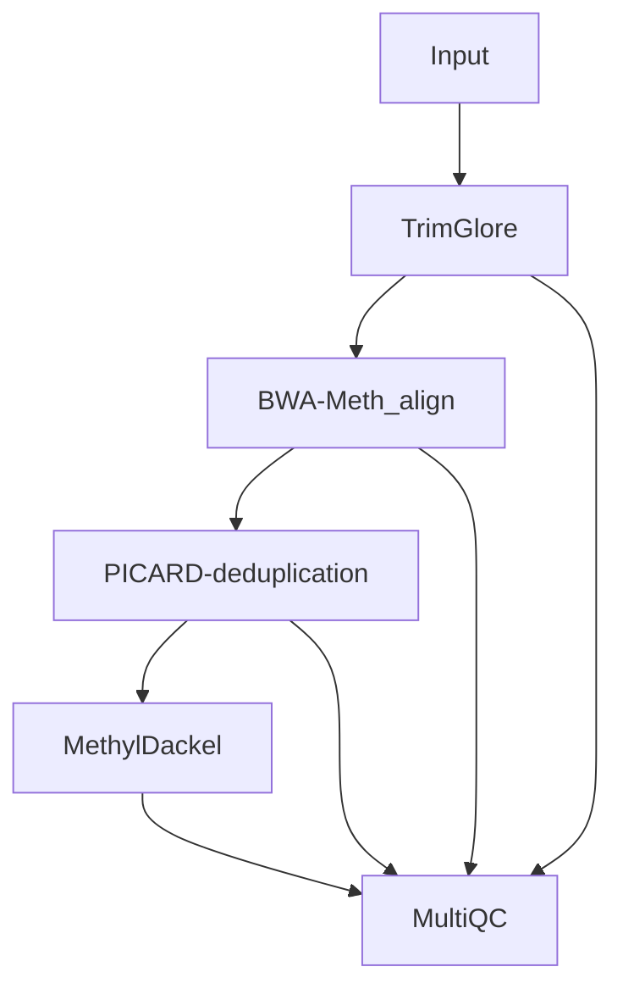

# nf_testdata

```mermaid
graph TD;
Input-->TrimGlore;
TrimGlore--> BWA-Meth_align;
BWA-Meth_align-->PICARD-deduplication;
PICARD-deduplication-->MethylDackel;
TrimGlore-->MultiQC;
PICARD-deduplication-->MultiQC;
BWA-Meth_align-->MultiQC;
MethylDackel-->MultiQC;
```
